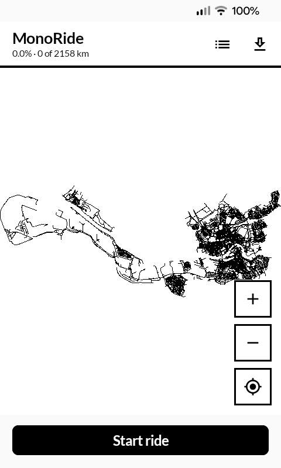
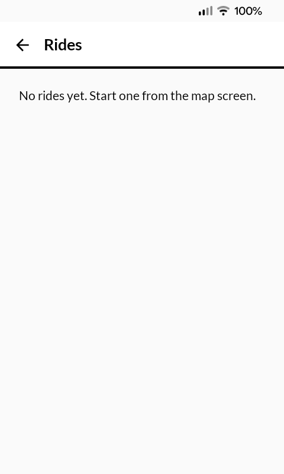
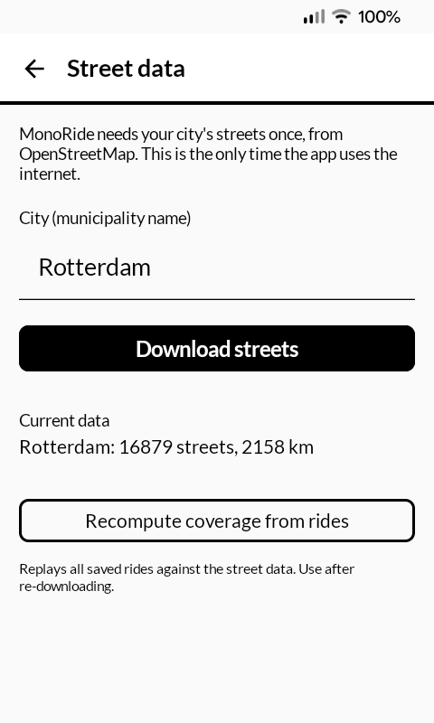

# MonoRide

MonoRide records your bike rides and shows how much of your city you have ridden, street by street. It is made for riding every street in your city. Built for the Mudita Kompakt e-ink phone with MMD.

The app talks to one external service, a single time: it downloads your city's street network from [OpenStreetMap](https://www.openstreetmap.org) through the Overpass API (overpass-api.de). The only thing sent is the city name you type. After that the app works fully offline and nothing ever leaves the phone.

  
  
  

## Install

Download the latest APK from the [releases page](../../releases) and sideload it,
or build from source:

    ./gradlew installDebug

## How it works

Open the street data screen, type your city (the municipality name as it appears on OpenStreetMap, for example Rotterdam) and download it once. Then press "Start ride" before you set off. The phone records your position in the background, so the screen can sleep while you ride. Press "Stop ride" when you are done.

Every ride is saved as a standard GPX file, so other apps and sites like CityStrides or Wandrer can read them. The rides screen can export all rides merged into a single GPX file.

Coverage itself is stored separately as a small binary set: each street is cut into 25 meter pieces, and a piece is either ridden or not. Riding a street twice adds nothing, so the coverage data stays small no matter how much you ride. The map draws unridden streets as thin lines and ridden ones as thick lines, plain black on white for the e-ink screen. The percentage in the header is ridden street length divided by the total street length of your city.

The streets that count are the ones you can legally bike on: residential streets, cycle paths, living streets and normal roads. Motorways, foot-only paths and roads where you must use a parallel cycle path are left out.

## Structure

- `app/src/main/java/com/monoapps/monoride/MainActivity.kt` - app entry and screen switching
- `app/src/main/java/com/monoapps/monoride/RideViewModel.kt` - app state, coverage bookkeeping, download and export
- `app/src/main/java/com/monoapps/monoride/RideService.kt` - foreground service that records GPS fixes to GPX
- `app/src/main/java/com/monoapps/monoride/data/Streets.kt` - street model, piece geometry and binary storage
- `app/src/main/java/com/monoapps/monoride/data/Overpass.kt` - one-time street download from OpenStreetMap
- `app/src/main/java/com/monoapps/monoride/data/Coverage.kt` - ridden piece set, matching rides to streets
- `app/src/main/java/com/monoapps/monoride/data/Gpx.kt` - GPX reading, writing and merged export
- `app/src/main/java/com/monoapps/monoride/ui/MapScreen.kt` - the map with pan, zoom and ride controls
- `app/src/main/java/com/monoapps/monoride/ui/RidesScreen.kt` - ride list, delete and export
- `app/src/main/java/com/monoapps/monoride/ui/DataScreen.kt` - city download and recompute

## Support

If you find this app useful, consider [sponsoring me](https://github.com/sponsors/berendsliedrecht).

## License

[MIT](LICENSE)
